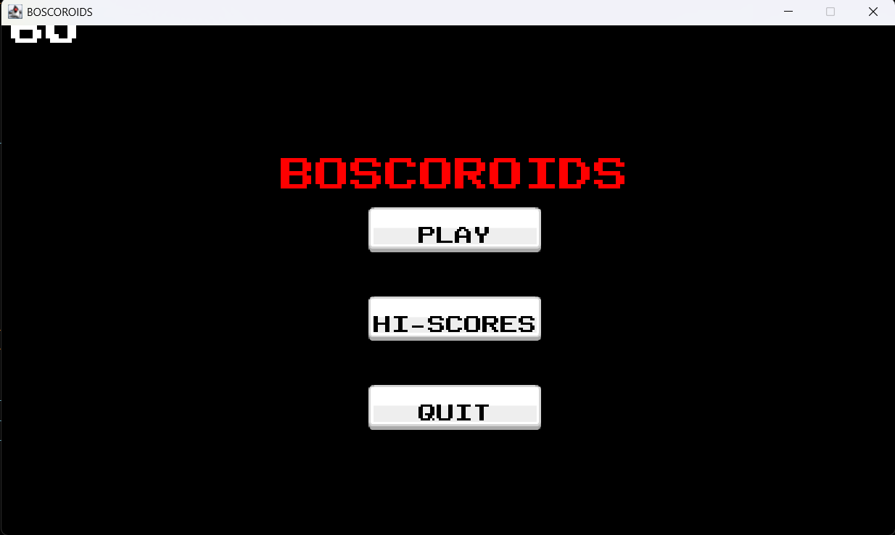
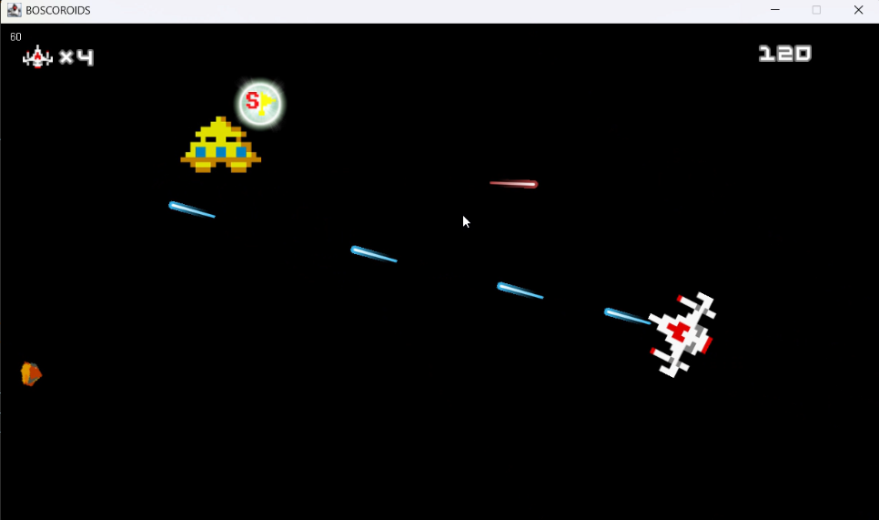
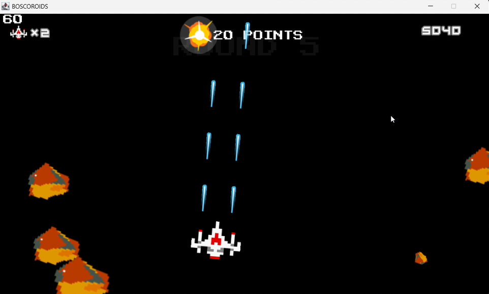

# BOSCOROIDS

ボスコロイドは、Java Swingを使用したAsteroids風の2Dシューティングゲームです。

プレイヤーはファイターを操作し、飛来する隕石を撃破しながらスコアを稼ぎます。

複数のパワーアップアイテムを駆使し、高得点を目指しましょう！





## 特徴

・クラシックなゲーム性: シンプルな操作で誰でも楽しめる

・パワーアップアイテム: 攻撃力や移動性能を強化するアイテムを実装

・スコア保存機能: ゲーム終了後にスコアデータを JSON 形式で保存

## 🎮 操作方法
| アクション | 操作キー |
|------------|---------|
| **左回転** | ←(左キー) |
| **右回転** | →(右キー) |
| **前進** | ↑(上キー) |
| **弾丸発射** | スペースキー |

---

## スコア表
| 敵キャラクター| スコア |
|------------|---------|
| 隕石 | 20 pts |
| UFO | 40 pts |

---

## アイテム一覧
| アイテム | 効果 |
|------------|---------|
| シールド(盾) | 一定時間、隕石を防ぐバリアを張る。ただし、UFOの攻撃は防ぐことが出来ないので注意。 |
| ラッキーフラッグ(Lフラッグ) | 一定時間、スコアがx2倍になる。 |
| スペシャルフラッグ(Sフラッグ) | 1UPアイテム。取るとライフが1増加する。 |
| ラピッドファイアー(サンダー) | 一定時間、ショットの発射スピードが向上し、中程度の連射が可能になる。 |
| ダブルガン | 一定時間、弾丸を2発同時に発射できるようになる。 |
| パックマン | 取ると1000 pts獲得。 |

---

## 🛠️ 動作環境
- **JDK 23**
- **Java Swing**
- **Java Sound API**

---

## 🚀 実行方法
1. **Javaをインストール**
   
   Java Development Kit(JDK)をインストールしてください。
   
   (最新版のJDKを推奨)

2. **リポジトリのクローン(ダウンロード)**
   
   ターミナルまたはコマンドプロンプトで以下を実行:
   ```sh
   git clone https://github.com/motomasMINO/Boscoroids-Java.git

   cd Boscoroids-Java
3. **コンパイル & 実行**
   ```sh
   javac -cp "lib/*" -d out src/*.java

   java -cp "out;lib/*" Window
   ```
   ✅ Mac/Linux の場合: out;lib/* → "out:lib/*" に変更

※起動後すぐにゲームがスタートします。

**注**: 1回目のゲームスタート時にフリーズする場合があります。その際は一度ウィンドウを閉じ、再起動を試してください。

## 開発のこだわり・工夫した点

- **パワーアップアイテムの実装**

  異なる効果を持つ複数のアイテムをバランスよく組み込むのに少し苦労しました。

  攻撃系や防御系など、プレイヤーの戦略性を広げる工夫をしています。

- **スコアデータの保存(JSON)**

  高得点を記録できるよう、JSON 形式でスコアを保存する仕組みを実装しました。

  ファイルの読み書き処理や、データのフォーマット整備にも力を入れました。

## 📜 ライセンス

このプロジェクトはMIT Licenseのもとで公開されています。

## 📧 お問い合わせ

- **Github: motomasMINO**

- **Email: yu120615@gmail.com**

  バグ報告や改善点・機能追加の提案はPull RequestまたはIssueで受け付けています!
